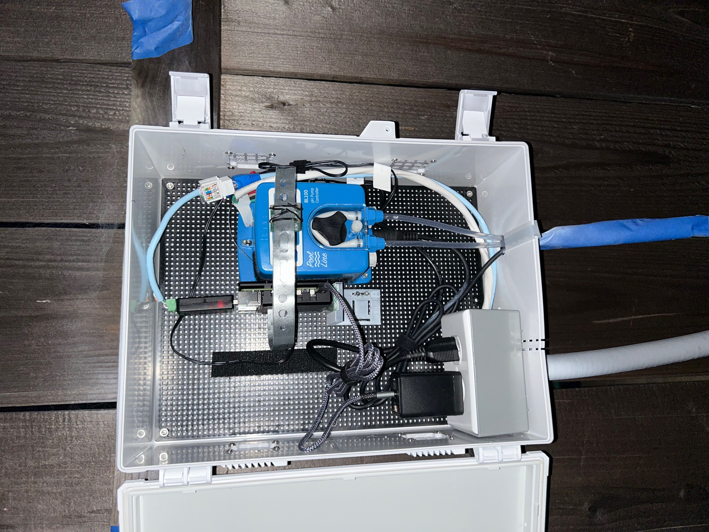
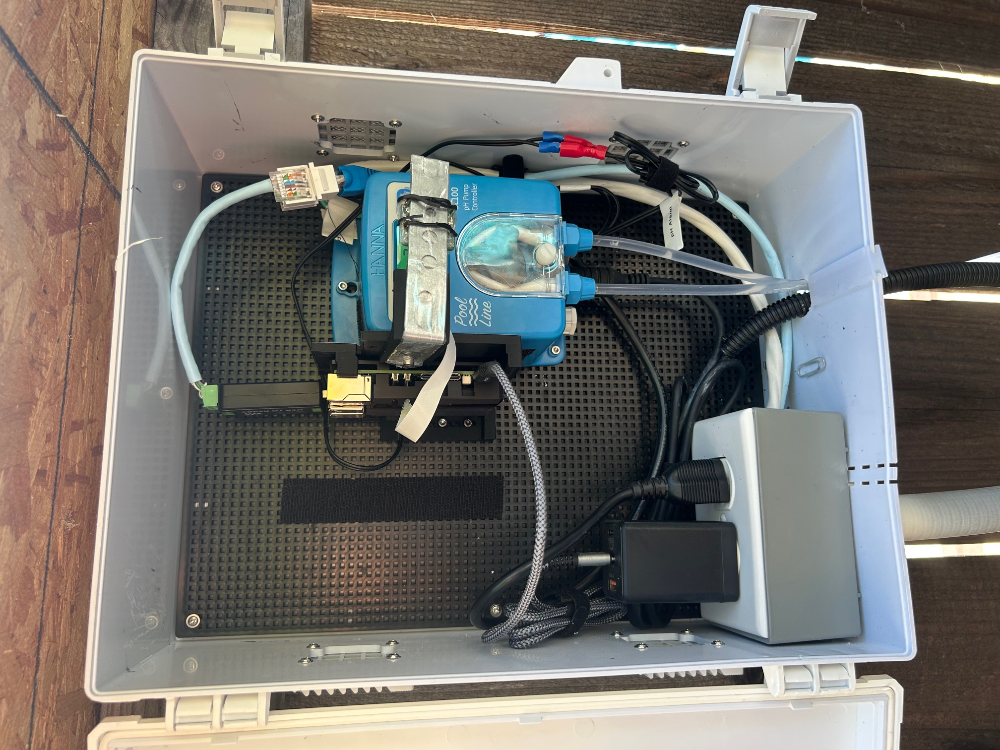

# Chem Feeder MQTT

This project provides detection of Pool pH value and report to AquaLinkD via MQTT service.

 * Using a camera to capture the pH controller screen
 * Extract the pH value from the LCD 7 segment display
 * Make a connection to the MQTT service to publish the pH value 

This work makes use of https://github.com/ved-sharma/Digits_recognition_OpenCV_Python and https://pyimagesearch.com/2018/09/17/opencv-ocr-and-text-recognition-with-tesseract.

Currently, there are two vesions - Python and C++. The Python version is tested and updated. The C++ version is outdated.

# Hardware
The hardware includes:

* Raspberry PI 5
* Hanna BL100 Pool & Spa Ph Controller/Dosing pump
* Arducam for Raspberry Pi Camera Module 3 Wide, 120° IMX708 Manual Focus with M12 Lens (need manual focus)
* RPI heat sink (GeeekPi Aluminum Heatsink Case for Raspberry Pi 5, Aluminum Alloy Armor Case, Passive Cooling Case)

The Raspbery PI 5 also runs AqualinkD.

# pH Report Values

| pH            | Description                           |
|---------------|---------------------------------------|
|  0.0          | Unit is powered off or no LCD display |
|  1.0          | Alarm is asserted by the unit         |
|  2.0          | Unable to detect digits correctly     |
|  other values | Values as reported by the unit         |

# How to position the camera?

You need to position the camera such that it captures the outer square outline of the LCD screen.
Refer to image below as an exmpale:


You can run this application to have a live view from browser:

``
    python ./src/rpicam-stream.py
``

Then, on the browser: 

``
    http://<ip address>:5000
``

Below is an image of the pH Controller and RPI camera mount:

To mount the camera over the LCD display, use galvanized interlocking hanger strap. I strapped my pH tank with this. Wrap the hanger strap with some transparent tape. Then bend and squeeze in between the RPI heat sink.



There is also mounting 3D models located at folder models. This will make adjust much simple.




# Configuration with RPI GPIO

GPIO Pin 0 - Power: This pin is used to detect power to the pH controller (active low).

GPIO Pin 16 - Alarm: This pin is used to detect pH controller alarm (active high). Connect to controller Normal Open (NO) side.

Use this command:

python ./ph-chem-feeder.py --mqtt --password "change to your password" --gpio

If you need more options, run with argument "--help".

# Configuration without RPI GPIO

python ./ph-chem-feeder.py --mqtt --password "change to your password"

If you need more options, run with argument "--help".

# Configure to start at system boot

See scripts/chem-feeder-mqtt.service

# What to do if it is not detecting digits correctly?

So far, it seems to be functionaly correctly. If you need to tune for your LCD display, try the following:

1. Using rpicam-still application, capture some images.
2. Edit ph-chem-feeder.py and set DBG_LEVEL to "1 + 2 + 4".
3. Disable "PICAM" and "RPIGPIO" by set them to 0.
4. Run this command on your PC or Linux with desktop GUI:

   python ./ph-chem-feeder.py -f "path to your image"

This will show you what the image looks like. 

First, make sure that the detection of the screen is correct. It should crop to just the LCD screen. Refer to image below:


Second, make sure that each digit has a rectangle draw on it. This indicates that it detected the location of the 3 digits.


Finally, the decode of each digits. This last part should just work. Otherwise you will need to adjust the detection of the individual segment by changing this code fragment:

```
        # define the set of 7 segments
        segments = [
            ((0, 0), (w, dH)),							 # top
            ((2, 0), (dW + 2, h // 2)),					 # top-left
            ((w - dW - 2, 0), (w, h // 2)), 			 # top-right
            ((0, (h // 2) - dHC), (w, (h // 2) + dHC)),  # center
            ((0, h // 2), (dW, h)),						 # bottom-left
            ((w - dW*2, h // 2), (w - 2, h)),		     # bottom-right
            ((0, h - dH), (w, h))					     # bottom
        ]
```

# Run Regression Testing

To run a regression testing with all images in folder test-images with first 3 letters as digit, issue the following command:

```
    python .\src\ph-chem-feeder.py -r 90 --selftest
    Chem Feeder MQTT
    PASSED 17/17
```

# Background on the Overall Algorithm

The general idea is:

1. Capture 5 images for 1 second
2. Using these 5 images, determine if the LCD is ON or OFF. This is for the case where the LCD is flashing due to alarm.
3. If it is OFF, report 1.0 and stop
4. Using the image with most white color pixel, determine the LCD location and crop 100 pixel border all around
5. Determine the contour of the LCD using OpenCV
6. Scale the image to 512 pixel and transpose the LCD image into a rectangle using OpenCV
7. Scale the image to 128 pixel and determine all the LCD digits using OpenCV
8. For each LCD digits, determine whether each segment is ON (white) or OFF (black). Then decode the digit from these on/off segment.
9. If the operation failed to determine the digits or transpose, adjust the black and white binary mapping threshold and try again.
10. If the operation failed to determine the digits, adjust the exposure and try again.
11. Final, try a second time if it failed before report 2.0 for error decode the digit. 

# Misc Note

If your camera is mounted at a different direction, use the "-r" parameter to rotate.
