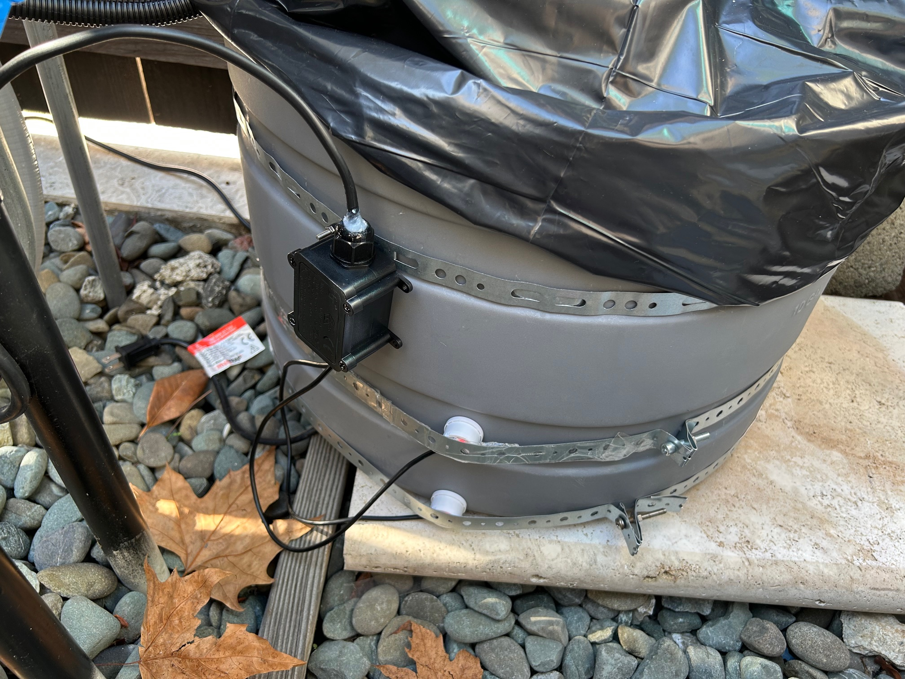
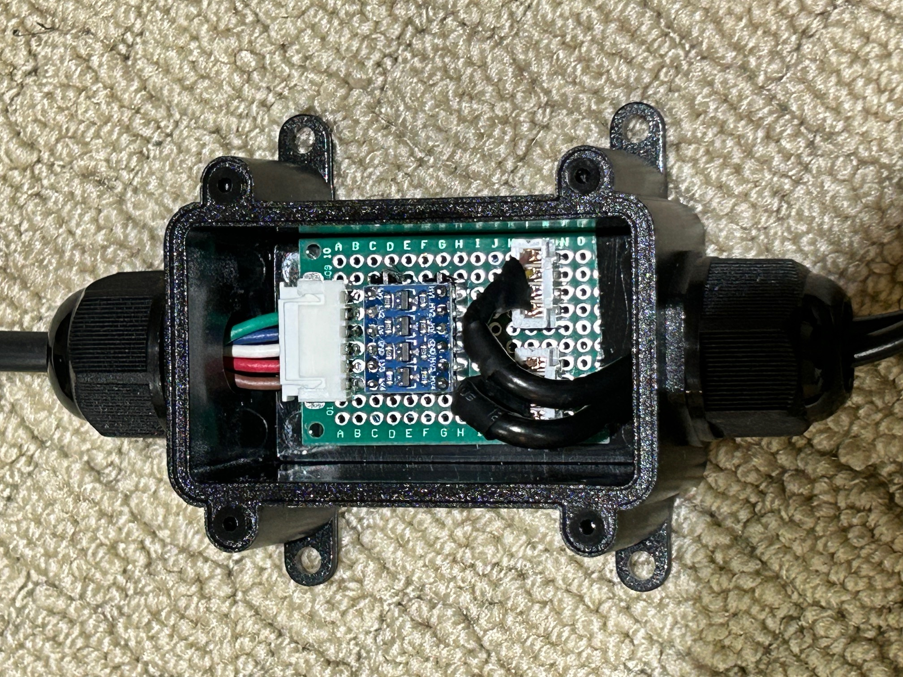
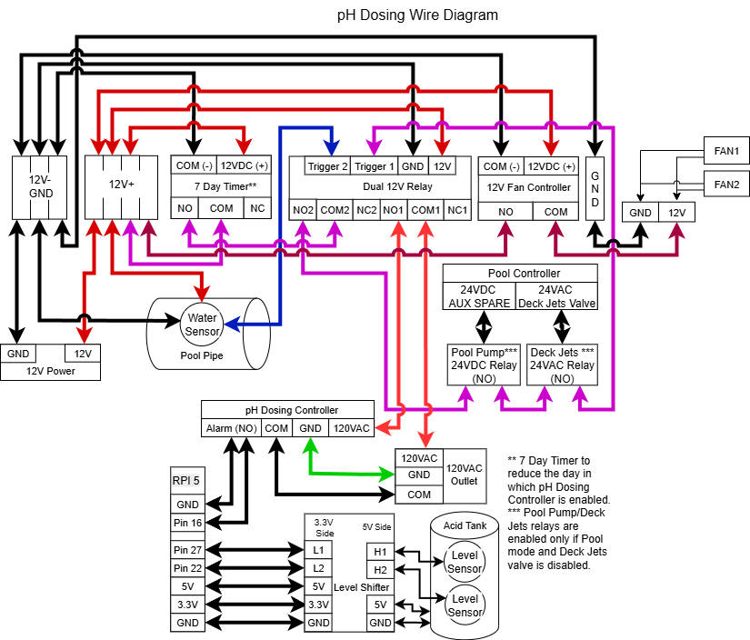
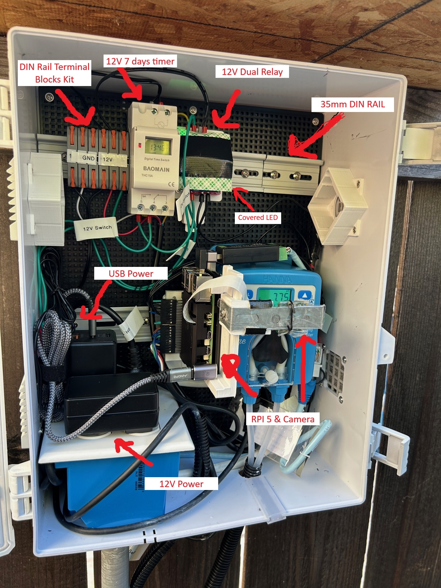
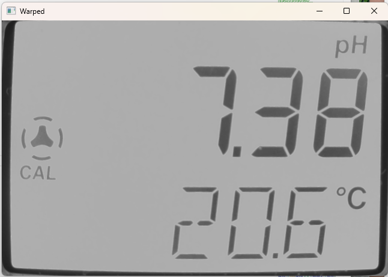
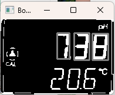

# Chem Feeder MQTT

This project provides detection of Pool pH value and report to AquaLinkD via MQTT service.

 * Using a camera to capture the pH controller screen
 * Extract the pH value from the LCD 7 segment display
 * Make a connection to the MQTT service to publish the pH value
 * Report pH controller alarm to MQTT service
 * Report Acid tank level to MQTT service

This work makes use of https://github.com/ved-sharma/Digits_recognition_OpenCV_Python and https://pyimagesearch.com/2018/09/17/opencv-ocr-and-text-recognition-with-tesseract.

Currently, there are two vesions - Python and C++. The Python version is tested and updated. The C++ version is outdated.

# Hardware
The hardware includes:

* Raspberry PI 5
* Hanna BL100 Pool & Spa Ph Controller/Dosing pump
* Arducam for Raspberry Pi Camera Module 3 Wide, 120° IMX708 Manual Focus with M12 Lens (need manual focus)
* RPI heat sink (GeeekPi Aluminum Heatsink Case for Raspberry Pi 5, Aluminum Alloy Armor Case, Passive Cooling Case)

The Raspbery PI 5 also runs AqualinkD.

## Acid Tank Sensor

For Acid Tank sensor, preferred non-contact sensor such:

* XKC-Y25-V Non Contact Liquid Level Sensor (https://www.amazon.com/dp/B0C73F96MF?ref=ppx_yo2ov_dt_b_fed_asin_title) - 2 totals
* KeeYees 10pcs 4 Channels IIC I2C Logic Level Converter Bi-Directional Module 3.3V to 5V Shifter (https://www.amazon.com/dp/B07LG646VS?ref=ppx_yo2ov_dt_b_fed_asin_title)
* IP68 Waterproof Junction Box Housing (https://www.amazon.com/dp/B0CP88ZFWL?ref=ppx_yo2ov_dt_b_fed_asin_title&th=1)
* JST XH 2.54 MM Connector Kit (https://www.amazon.com/dp/B0F5QBR5F4?ref=ppx_yo2ov_dt_b_fed_asin_title&th=1)

This requires a level shifter as the voltage is 5V and RPI 5 requires 3.3V. Then create the adapter board with JST connector. See images below:


 | 

To ensure that the junction box is sealed, apply some window sealant on the wire exit.

## Relay & Wiring Diagram

The Acid Dosing Controller can dangerous. As such the following safety measures are employed:

* Acid Dosing Controller is enabled only if the system is in Pool mode
* Acid injector is mounted at the Pool return pipe only
* Sensor is used to ensure that the Acid Dosing Controller is only enabled if the pump is actually running
* A timer to limit the amound of time the Acid Dosing Controller is enabled (avoid hardwaer malfunction and dump a large amount of acid to the pool)

To implement the above, the following hardwares are used:

* A 12V dual relay to disable Acid Dosing Controller if it is NOT in pool mode and no water flow
* A 12V 7 day timer

12V is used as fan are also 12V. Fan can be added to cool the electronic in the enclosure box. The wire diagram is shown below.



## Mounting

To mount various hardware, use Aluminum DIN Rails (https://en.wikipedia.org/wiki/DIN_rail).

The folder "models" includes various 3D print models for DIN rail mounting.


# pH Report Values

| pH            | Description                           |
|---------------|---------------------------------------|
|  0.0          | Unit is powered off or no LCD display |
|  1.0          | Unable to detect LCD correctly        |
|  2.0          | Unable to detect digits correctly     |
|  other values | Values as reported by the unit        |

Alarm is reported via the web site interface. Refer to section "Enable pH Data Logging and Web Page".

# How to position the camera?

You need to position the camera such that it captures the outer square outline of the LCD screen.
Refer to image below as an exmpale:


You can run this application to have a live view from browser:

``
    python ./src/rpicam-stream.py
``

Then, on the browser: 

``
    http://<ip address>:5000
``

Below is an image of the pH Controller and RPI camera mount:

To mount the camera over the LCD display, use galvanized interlocking hanger strap. I strapped my pH tank with this. Wrap the hanger strap with some transparent tape. Then bend and squeeze in between the RPI heat sink. There is also mounting 3D models located at folder models. This will make adjust much simple.

 | 


# Configuration with RPI GPIO

GPIO Pin 16 - Alarm: This pin is used to detect pH controller alarm (active high). Connect to controller Normal Open (NO) side.

GPIO Pin 27 - Acid Tank Level1: When this is asserted low, acid tank is below 1%.

GPIO Pin 22 - Acid Tank Level2: When this is asserted low, acid tank is below 50%.

Use this command to enable GPIO:

```
python ./ph-chem-feeder.py --mqtt --password "change to your password" --gpio
```

Use this command to enable and change GPIO pin:

```
python ./ph-chem-feeder.py --mqtt --password "change to your password" --gpio <alarm pin> <acid level1> <acid level2>
```

If you need more options, run with argument "--help".

# Cropping Image

Due to LED of various electronic, you may need to crop the image using the argument "--crop" or cover these LEDs. This argument will crop from four sides.

This command will crop the left side by 400 pixels.

```
python ./ph-chem-feeder.py --crop 400 0 0 0 --mqtt --password "change to your password" 

```


# Configure to start at system boot

See scripts/chem-feeder-mqtt.service

# Enable pH Data Logging and Web Page

To record pH reading for view on a web page, you must enable data logging as follow:

```
python3 ph-chem-feeder.py --gpio --mqtt --password <your password> --gpio --datalog /home/pi/chem-data.bin

```

When pH value is changed from previous value, it saved to the datalog file. All non-zero pH value is only saved every 15 minutes. 

The data can be view from a web page as follow:

```
http://<ip address>:8025

```

Below is an screen shoot of the web page.


# What to do if it is not detecting digits correctly?

So far, it seems to be functionaly correctly. If you need to tune for your LCD display, try the following:

1. Using rpicam-still application, capture some images.
2. Edit ph-chem-feeder.py and set DBG_LEVEL to "1 + 2 + 4".
3. Disable "PICAM" and "RPIGPIO" by set them to 0.
4. Run this command on your PC or Linux with desktop GUI:

   python ./ph-chem-feeder.py -f "path to your image"

This will show you what the image looks like. 

First, make sure that the detection of the screen is correct. It should crop to just the LCD screen. Refer to image below:



Second, make sure that each digit has a rectangle draw on it. This indicates that it detected the location of the 3 digits.




Finally, the decode of each digits. This last part should just work. Otherwise you will need to adjust the detection of the individual segment by changing this code fragment:

```
        # define the set of 7 segments
        segments = [
            ((0, 0), (w, dH)),							 # top
            ((2, 0), (dW + 2, h // 2)),					 # top-left
            ((w - dW - 2, 0), (w, h // 2)), 			 # top-right
            ((0, (h // 2) - dHC), (w, (h // 2) + dHC)),  # center
            ((0, h // 2), (dW, h)),						 # bottom-left
            ((w - dW*2, h // 2), (w - 2, h)),		     # bottom-right
            ((0, h - dH), (w, h))					     # bottom
        ]
```

# Run Regression Testing

To run a regression testing with all images in folder test-images with first 3 letters as digit, issue the following command:

```
    python .\src\ph-chem-feeder.py -r 90 --selftest
    Chem Feeder MQTT
    PASSED 17/17
```

# Background on the Overall Algorithm

The general idea is:

1. Capture 20 images with delay of 50ms
2. Using these images, determine if the LCD is ON or OFF. This is for the case where the LCD is flashing due to alarm.
3. If it is OFF, report 0.0 and stop
4. For image that is not complete black, determine the LCD location and crop 100 pixel borders
5. Determine the contour of the LCD using OpenCV
6. Scale the image to 512 pixel and transpose the LCD image into a rectangle using OpenCV
7. Scale the image to 128 pixel and determine all the LCD digits using OpenCV
8. For each LCD digits, determine whether each segment is ON (white) or OFF (black). Then decode the digit from these on/off segment.
9. If the operation failed to determine the digits or transpose, adjust the black and white binary mapping threshold and try again.
10. If the operation failed to determine the digits, adjust the exposure and try again.
11. Final, try three times.
12. If all failed, report 2.0 for error decoding digits.

# Homebridge MQTT Integration for Acid Tank Level & Alarm

To report Acid Tank Level and Alarm in HomeKit, install the homebridge-mqtt plugin (https://github.com/cflurin/homebridge-mqtt).

The configuration setting:

```
        {
            "name": "mqtt",
            "url": "mqtt://127.0.0.1",
            "port": "1883",
            "username": "pi",
            "password": "password",
            "qos": 0,
            "topic_type": "multiple",
            "topic_prefix": "homebridge",
            "platform": "mqtt"
        }
```

# Misc Note

If your camera is mounted at a different direction, use the "-r" parameter to rotate.

