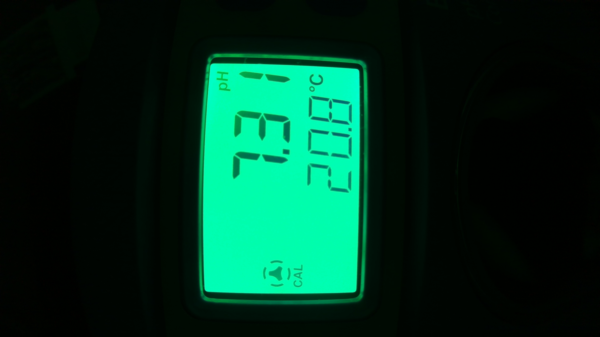

# Chem Feeder MQTT

This project provides detection of Pool pH value and report to AquaLinkD via MQTT service.

 * Using a camera to capture the pH controller screen
 * Extract the pH value from the LCD 7 segment display
 * Make a connection to the MQTT service to publish the pH value 

This works make use of https://github.com/ved-sharma/Digits_recognition_OpenCV_Python and https://pyimagesearch.com/2018/09/17/opencv-ocr-and-text-recognition-with-tesseract.

Currently, there are two vesions - Python and C++. The Python version is tested and updated. The C++ version is outdated.

# Hardware
The hardware includes:

* Raspberry PI 5
* Hanna BL100 Pool & Spa Ph Controller/Dosing pump
* Arducam for Raspberry Pi Camera Module 3 Wide, 120° IMX708 Manual Focus with M12 Lens (need manual focus)
* RPI heat sink (GeeekPi Aluminum Heatsink Case for Raspberry Pi 5, Aluminum Alloy Armor Case, Passive Cooling Case)

The Raspbery PI 5 also runs AqualinkD.

To mount the camera over the LCD display, use galvanized interlocking hanger strap. I strapped my pH tank with this. Wrap the hanger strap with some transparent tape. Then bend and squeeze in between the RPI heat sink.

# How to position the camera?

You need to position the camera such that it captures the outer square outline of the LCD screen.
Refer to image below as an exmpale:

# Configuration with RPI GPIO

GPIO Pin 16 - Power: This pin is used to detect power to the pH controller (active low).

GPIO Pin 12 - Alarm: This pin is used to detect pH controller alarm (active low).

Use this command:

python ./ph-chem-feeder.py --mqtt --password "change to your password" --gpio

If you need more options, run with argument "--help".

# Configuration without RPI GPIO

python ./ph-chem-feeder.py --mqtt --password "change to your password"

If you need more options, run with argument "--help".

# Configure to start at system boot

See scripts/chem-feeder-mqtt.service

# What to do if it is not detecting digits correctly?

So far, it seems to be functionaly correctly. If you need to tune for your LCD display, try the following:

1. Using rpicam-still application, capture some images.
2. Edit ph-chem-feeder.py and set DBG_LEVEL to "1 + 2 + 4".
3. Disable "PICAM" and "RPIGPIO" by set them to 0.
4. Run this command on your PC or Linux with desktop GUI:

   python ./ph-chem-feeder.py -f "path to your image"

This will show you what the image looks like. 

First, make sure that the detection of the screen is correct. It should crop to just the LCD screen.

Second, make sure that each digit has a rectangle draw on it. This indicates that it detected the location of the 3 digits.

Finally, the decode of each digits. This last part should just work. Otherwise you will need to adjust the detection of the individual segment.

# Misc Note

If your camera is mounted at a different direction, use the "-r" parameter to rotate.
